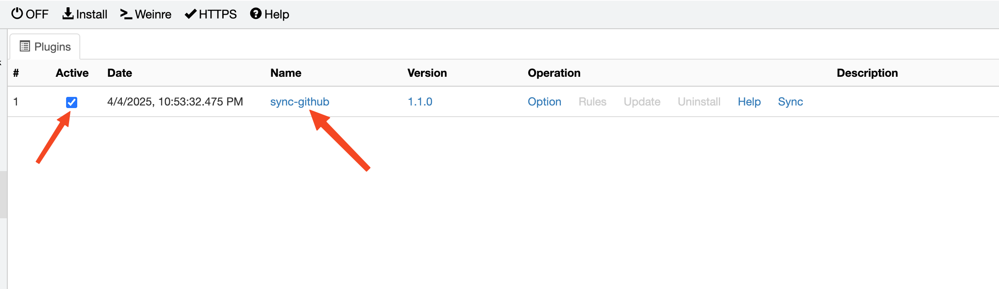

# whistle.sync-github
> 使用该插件建议用最新版本的 [whistle](https://wproxy.org/whistle/update.html)

该插件从 github 拉取 Rules, Values 配置。

# 安装

1. 首先需要安装最新版 [whistle](https://github.com/avwo/whistle)，如果你的机器已经安装了 whistle，请确保 whistle 为最新版本：

   - 安装及如何使用 whistle 参见 [Github](https://github.com/avwo/whistle)
   - 如何升级 whistle 参见[帮助文档](http://wproxy.org/whistle/update.html)。

2. 安装 sync-github 插件：

    ```
    w2 i whistle.sync-github
    ```
    > 或使用 cnpm 镜像 `w2 i whistle.sync-github --registry=https://registry.nlark.com`
    > 如果已安装 cnpm，还可以用 `w2 ci whistle.sync-github`

# 保存配置在 Github

- 将需要备份的配置上传到仓库即可.
- Rules 和 Values 分别放在两个文件夹中，方便区分.

# 使用

- 打开 `https://local.whistlejs.com/#plugins` ， 进入 plugin 页面, 确保插件 `sync-github` 是激活状态，点击 `sync-github`


- 填写 Git 仓库地址、分支、rules 文件夹、 values 文件夹信息，点击保存配置，然后再点击 `从Git同步`


- 等提示同步成功


- 关闭此弹窗，返回 Plugins 页面，点击 Sync 按钮


- 此时就可以选择拉取远端的 Rules 或者 Values 了


- 若你填的配置和我的一样，那么点击 `Sync Rules`，你应该看到的和我的一样


- 然后就是根据需要添加规则；不需要的点击 `Delete` 就不会在本次添加中添加到你本地；点击 `Content` 可以查看文件内容


# 同步原理

## Git 同步

- 根据配置，直接拉取仓库到本地，然后在 Plugins 页面，点击 Sync Rule/Values 即直接读取本地已同步的数据。

- 同步操作：需要近配置页面，点击 `从Git同步` 按钮，然后再在 Plugins 页面，点击 `Sync Rule/Values`，即可同步。（Whistle 限制 `Sync Rule/Values` 请求时常过长会超时，所以只能将数据同步按钮放至内层）。

- 推荐，适合同步较多文件

## Github 同步

- 直接通过 Github rest API 获取内容，（如需获取有权限的仓库需配置 token 记得开仓库读权限）；

- 同步操作：仅使用前配置一次仓库地址和 token 即可，后续直接在  Plugins 页面点击点击 `Sync Rule/Values`，即可同步。
  
- 不推荐，适合只同步较少的文件

# 反馈

有什么使用问题或建议欢迎反馈，顺手的话还请给个 star 🌟。
